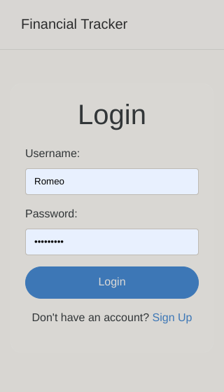
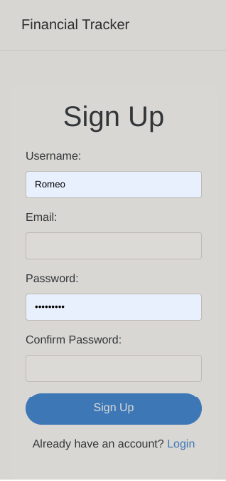
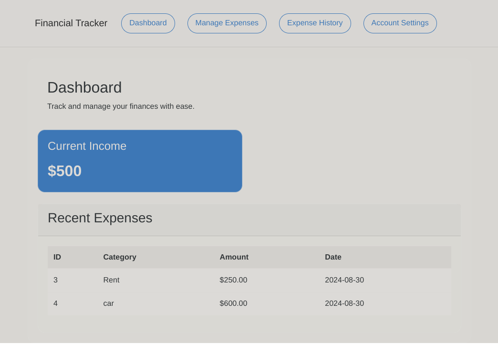
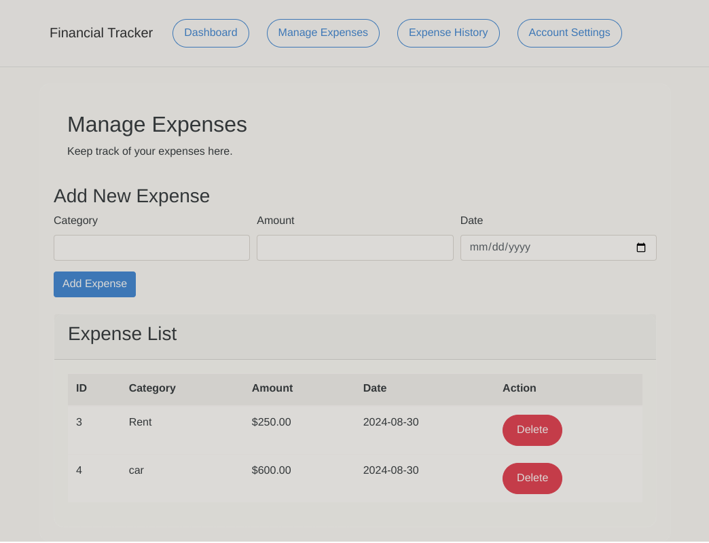

# Personal Financial Tracker

## Overview

This Flask application is designed to help users manage their personal finances. It allows users to sign up, log in, add and delete expenses, and view a dashboard of their financial activities. Users can also update their account details.

## Features

- **User Authentication**: Sign up, log in, and log out functionality.
- **Expense Management**: Add, view, and delete expenses.
- **Account Management**: Update user details.

## Requirements

- Python 3.x
- Flask
- MySQL Connector
- Werkzeug

## Preview

Below are previews of the authentication pages `1.png` and `2.png`.

 

Below are previews of the dashboard and the management page `3.png` and `4.png`.

 
