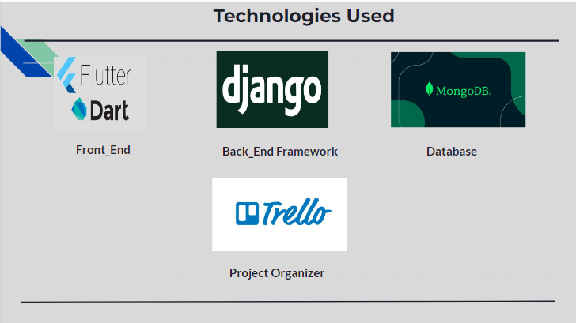
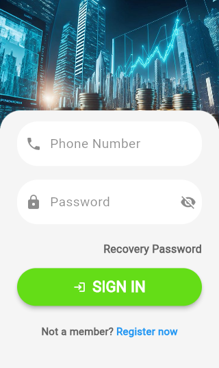

# Personal Financial Tracker

This project was developed in two versions. The first version was built using Flutter for the frontend, Django for the backend, and MongoDB for storage.  However, due to issues in retrieving data from the backend to the Flutter frontend, we designed a second version using Flask for the backend and SQL for storage, which proved easier to implement. Both versions now work as expected and meet the project's objectives.

## Project Overview

Our project is a modern cross-platform application that integrates a powerful backend with a very-friendly and responsive frontend. The frontend is built using **Flutter**, a UI toolkit that enables us to create natively compiled applications for mobile, web, and desktop from a single codebase. This allows for a seamless user experience across multiple platforms.

The backend is developed using **Django**, a high-level Python web framework known for its robustness and scalability. Django will handle the application's business logic, data management, and API integration, ensuring secure and efficient communication between the frontend and the backend.

Together, Flutter and Django provide a solid foundation for building a responsive, efficient, and scalable application that meets the needs of modern users.

## Technologies Used

- **Flutter**: For building the responsive and cross-platform frontend.
- **Django**: For managing the robust backend operations and APIs.
- **SQLite/PostgreSQL**: As the database management system for storing user data securely.
- **Django REST Framework**: For building APIs and handling authentication, permissions, and serialization.
- **Flutter Packages**: A variety of third-party packages to enhance the app’s functionality and user experience.
- **Docker** (Optional): For containerizing the application, making deployment easier and more consistent across different environments.

## Preview

